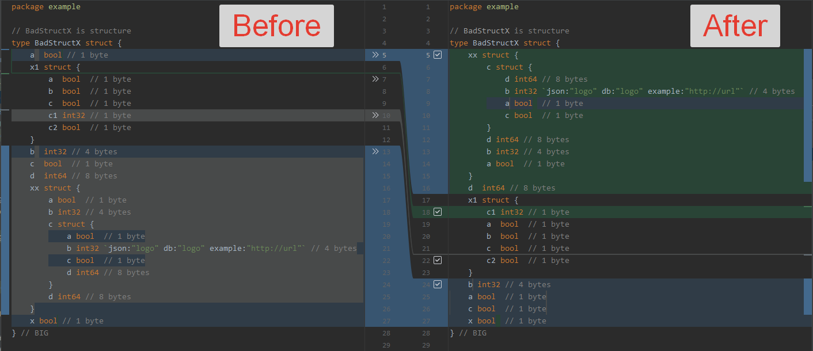
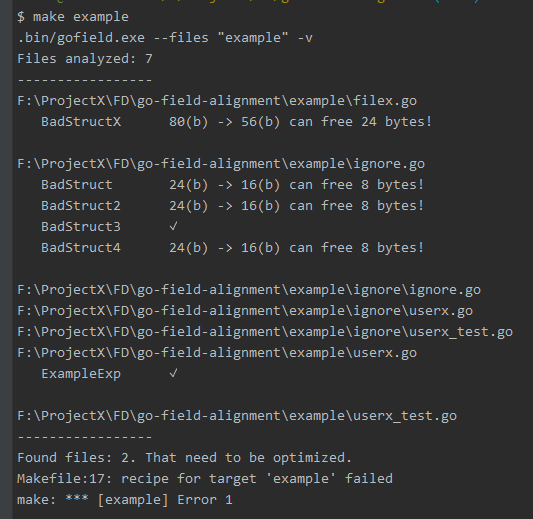

# Go-Pad

[](http://copyfree.org)
[](https://coveralls.io/github/t34-dev/go-pad-alignment?branch=main&ver=1725014699)


Go-Pad is a powerful tool designed for Golang developers to enhance code readability and optimize memory usage by performing multi-level field alignment in struct declarations while preserving original metadata.




## Features

- Analyzes struct field alignment and padding in Go source files
- Calculates the size and alignment of each struct and its fields
- Optimizes struct layout by reordering fields for better memory efficiency
- Performs multi-level struct field alignment for improved readability
- Preserves original comments and metadata
- Supports nested structs and complex type hierarchies
- Processes single files or entire directories
- Offers an option to automatically apply optimizations to source files
- Easily integrates with existing Go projects
- Provides debug mode for detailed analysis
- Supports custom file pattern matching and ignoring

## Installation

To install `gopad`, make sure you have Go installed on your system, then run:

```shell
# get all versions
go list -m -versions github.com/t34-dev/go-pad-alignment

# get package
go get -u github.com/t34-dev/go-pad-alignment@latest

# install package
go install github.com/t34-dev/go-pad-alignment/cmd/gopad@latest
```

For local installation:

```shell
# Bash
go build -o $GOPATH/bin/gopad       # Unix
go build -o $GOPATH/bin/gopad.exe   # Windows

# Makefile
make install                        # Any system
```

## Usage

```
gopad [options] <file or directory paths>
```

### Options

- `--files`, `-f`: Comma-separated list of files or folders to process (required)
- `--ignore`, `-i`: Comma-separated list of files or folders to ignore
- `--view`, `-v`: Print the absolute paths of found files
- `--fix`: Make changes to the files
- `--pattern`: Regex pattern for files to process (default: `\.go$`)
- `--ignore-pattern`: Regex pattern for files to ignore
- `--version`: Print the version of the program
- `--help`: Print usage information
- `--debug`: Enable debug mode

### Examples

1. Analyze all Go files in the current directory:
   ```
   gopad --files .
   ```

2. Optimize structs in specific files:
   ```
   gopad --files main.go,utils.go --fix
   ```

3. Process files matching a custom pattern:
   ```
   gopad --files src --pattern "\\.(go|proto)$"
   ```

4. Ignore test files:
   ```
   gopad --files . --ignore-pattern "_test\\.go$"
   ```

5. View files that would be processed without making changes:
   ```
   gopad --files src,pkg --view
   gopad --files "./internal/models/, ./cmd/" --view
   ```

6. Process multiple directories while ignoring specific folders:
   ```
   gopad --files "gopad,internal" --ignore "internal/generated"
   ```

7. Use debug mode for detailed analysis:
   ```
   gopad --files main.go --debug
   ```

8. Combine multiple options:
   ```
   gopad --files "src,pkg" --ignore "pkg/generated" --pattern "\\.(go|pb\\.go)$" --fix --view
   ```

## Output

For each struct found in the processed files, `gopad` will output:

- Struct name
- Total size of the struct (before and after optimization)
- Alignment of the struct
- For each field:
  - Field name
  - Field type
  - Offset within the struct
  - Size of the field
  - Alignment of the field

If the `--fix` option is used, it will also show the optimized layout of the struct and apply the changes to the source files.

When using the `--debug` option, Go-Pad provides a detailed before-and-after comparison of struct layouts.

## How It Works

1. Go-Pad parses the specified Go source files and identifies all struct declarations.
2. It analyzes the current layout of each struct, calculating sizes, alignments, and paddings.
3. The tool then optimizes the struct layout by reordering fields to minimize padding while maintaining correct alignment.
4. If the `--fix` option is used, Go-Pad rewrites the struct declarations in the source files with the optimized layout.
5. The tool preserves all comments and formatting to maintain code readability.

## Best Practices

- Run Go-Pad on your project before committing changes to ensure optimal struct layouts.
- Use the `--view` option to preview which files would be affected before applying fixes.
- Integrate Go-Pad into your CI/CD pipeline to catch suboptimal struct layouts early.
- When optimizing performance-critical code, use Go-Pad in conjunction with benchmarking to measure the impact of struct optimizations.

## Contributing

Contributions are welcome! Please feel free to submit a Pull Request. Here are some ways you can contribute:

- Improve documentation
- Add new features
- Fix bugs
- Optimize performance
- Write tests

Before submitting a pull request, please ensure your code passes all tests and adheres to the project's coding standards.

## License

This project is licensed under the ISC License. See the [LICENSE](LICENSE) file for details.

## Support

If you encounter any issues or have questions, please file an issue on the [GitHub repository](https://github.com/t34-dev/go-pad-alignment/issues).

---

Developed with ❤️ by [T34](https://github.com/t34-dev)
